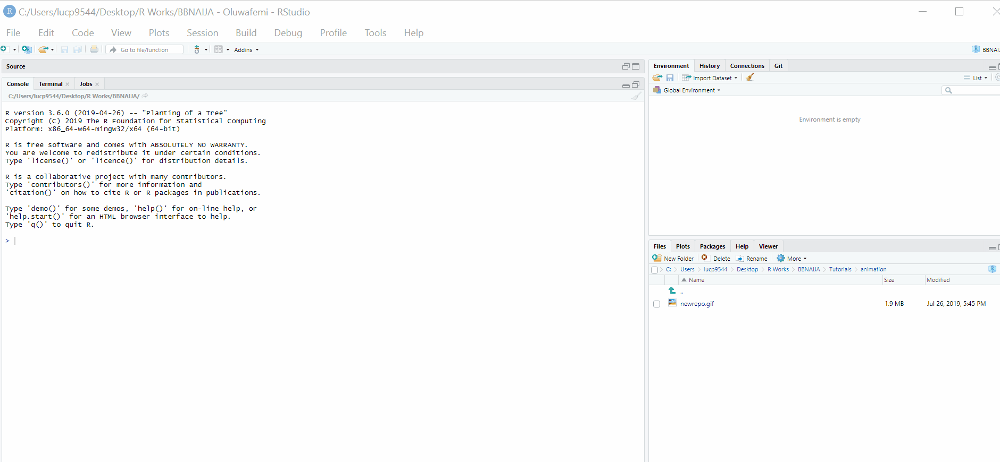
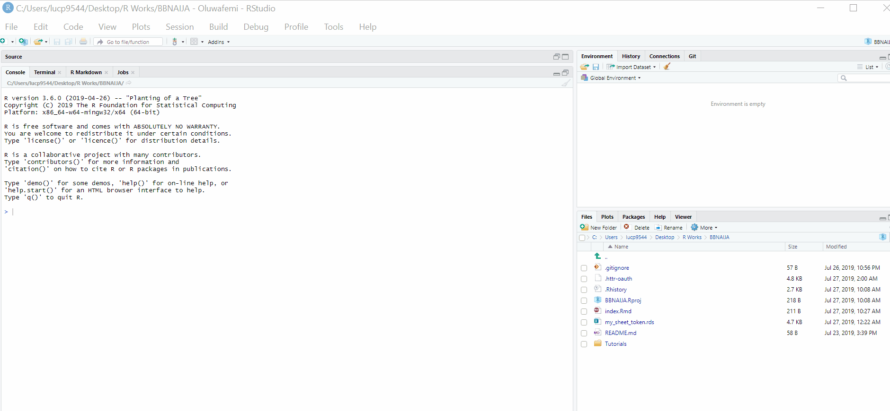

```{r setup, include=FALSE}
knitr::opts_chunk$set(echo = FALSE, 
                      message = FALSE,	
                      warning = FALSE)
options(htmltools.dir.version = FALSE)
```


class: inverse, right

<div style="text-align: left">


</div>

## Using R & Git for Collaborative Work <br> (Practical) <br> UI R Users Group, satRday

#### Owotomo O. E. <br> Olusoji O. D.  <br> Materials: https://github.com/R-Ibadan-Users-Group/BBNAIJA/tree/master/Tutorials

---

# Creating a GitHub Repo


<div style="text-align: center"> Quite Easy, isn't it? `r emo::ji("face_savoring_food")` </div>

* Create a repository (repo) in your GitHub account titled `First_Project` `r emo::ji("smile")`

---

# Creating a RPoject in RStudio



<div style="text-align: center"> Quite Easy, isn't it? `r emo::ji("face_savoring_food")` </div>

* Create a Project in **RStudio** using the URL of the repo you created `r emo::ji("smile")`

---

# Creating an RMarkdown File



---

# Basic Git Commands

** git add . ** `r emo::ji("point_right")` to add your local changes

** git commit -m "description_message_here" ** `r emo::ji("point_right")` to commit the changes made

** git push origin master ** `r emo::ji("point_right")` to push changes to the remote master repo

** git pull repo_url/repo_ssh** to pull changes made to the remote repo

### Some Bonus`r emo::ji("smile")`

* Should you forget to add the remote URL or want to connect a local repo to a remote one;
  - ** git remote add Repo_remote_URL** `r emo::ji("point_right")` adds a remote URL to your local repo.
* Want to initialize a repo locally 
  - ** git init ** `r emo::ji("point_right")` initialize a local repo.
* To add all changes made except a file
  - ** git add -u **
  - ** git reset -- file_name **
  - procedd with commit and push as usual
  
---

# Let's Play with Some Data

<iframe src="https://docs.google.com/forms/d/e/1FAIpQLSe6HtzYO7ylxx55F7nRqf8JFMGb6OhEQzspmIOjBVD9Zd2tdA/viewform?usp=sf_link/viewform?embedded=true" width="750" height="350" frameborder="0" marginheight="0" marginwidth="0">loading...</iframe>

<br>
* Create a `Rmd` file named `first.Rmd`. Check the file [here](http://rpubs.com/oodaniel/UIsatRday) and try to make your `first.Rmd` look like the this. Populate the missing parts and report the analysis of the data gathered.


---

# What about Collaboration? (Understanding Branches)

`Git branches` provides a framework for several people to work on the same project and file `r emo::ji("smiling_face_with_sunglasses")`

* Let us begin with the `BBNAIJA` project (close the current project and do the following in a fresh `RStudio session`);

    + Get an invitation to collaborate on a GitHub repo. (You are all being invited to the `BBNAIJA` project)

    + Clone the repo by copying the `SSH` or `https` link and running **git pull SSH/https_link** in your `RStudio` terminal.

    + Type **git checkout -b branch_name** in the `Terminal` to create your branch.
    
    + Use **git checkout branch_name** to switch between branches.
    
    + use **git commit** as usual
     
    + use **git push origin branch_name** to push to your branch.
    
    + use **git pull origin friend_branch_name** to pull changes your friend's changes.
    
---
    
# Introducing The BBNAIJA Project

* The project aims at the following;
    - extract data about BBANIJA from a social-media platform.
    - tidy and explore this data
    - predict chances of nominated housemates getting evicted using machine learning
    - write reports and build deliverables about this
    
* There is an `index.Rmd` file in the `BBNAIJA` repo you cloned which we will all be working on over the next few weeks.

  - You will all be divided into groups and each group will be working on different sections after the next set of lessons (`tidyverse` & `twitteR`)

* `r emo::ji("warning")` Don't merge your pull requests for the `BBNAIJA` projects, there is a special admin (`Abel`) to do that.

---

# Not to Forget the Thank Yous `r emo::ji("laughing")`

<br>

<br>

<br>

<br>
### ........................... Thank You all `r emo::ji("man_teacher")` `r emo::ji("woman_teacher")`.....................................

